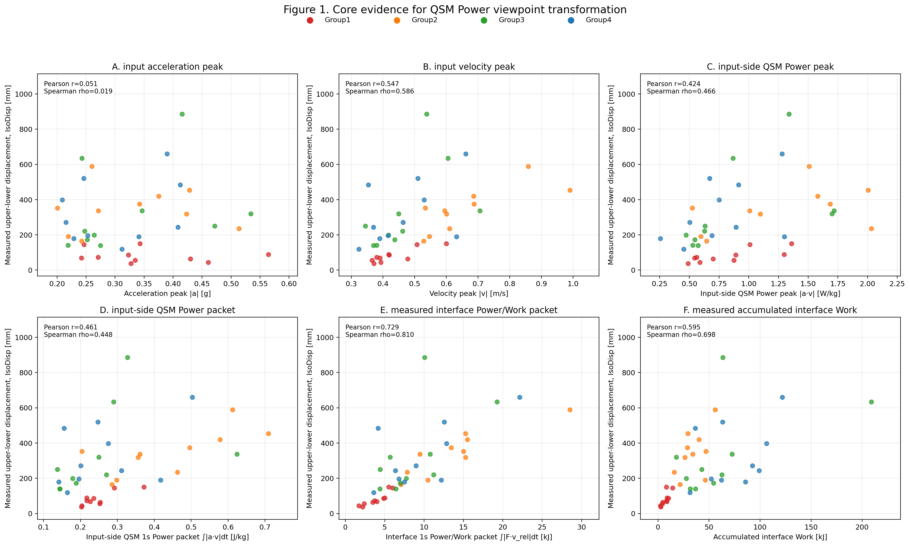
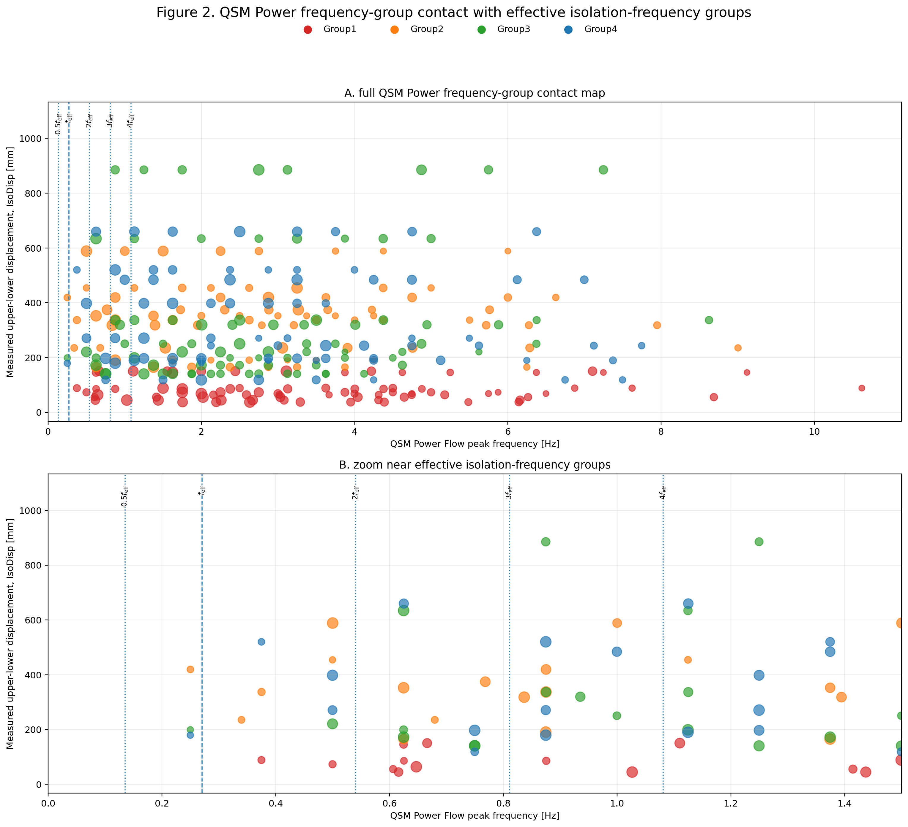

# Quantum Structural Mechanics Validation

This repository provides the real-data validation materials for **Quantum Structural Mechanics (QSM)** using experimental shaking-table data of a spherical sliding isolation system subjected to pulse-like ground motions.

The purpose of this repository is not only to reproduce conventional seismic-response indicators, but to re-read the isolation response through a QSM mechanism chain:

$$a(t),v(t)\rightarrow P_{\mathrm{in}}(t)=a(t)v(t)\rightarrow F_{\mathrm{interface}}(t)v_{\mathrm{rel}}(t)\rightarrow u_{\mathrm{iso}}(t)$$

In this view, a seismic wave is treated as an incoming power field. The isolation displacement is interpreted as the final manifestation of power after it enters the isolation interface, forms interface power/work exchange, and is converted into measurable upper-lower displacement response.

---

## Core Question

For a seismic isolation system, is the measured isolation displacement mainly explained by input acceleration, input velocity, or by the power exchange that occurs after the motion enters the isolation interface?

This repository tests that question by comparing:

1. input acceleration peak,
2. input velocity peak,
3. input-side QSM Power Flow,
4. 1-second QSM Power Packet,
5. measured Interface Power / Work Packet,
6. accumulated Interface Work,
7. QSM Power Frequency Groups,
8. Interface Frequency Groups,
9. measured displacement response frequency groups.

The central finding is that the clearest relationship with measured upper-lower isolation displacement appears after the input motion enters the isolation interface and forms measurable power/work exchange.

---

## Research Basis

This repository is built on a QSM validation article, the source experimental study, and the public experimental dataset listed below.

### How to Cite This Work

Kuo, H.-J. (2026). *Validating Quantum Structural Mechanics with Spherical Sliding Isolation Test Data*. GitHub. https://github.com/alaric-kuo/Quantum-Structural-Mechanics-Validation

### References

Yang, Y.-H., Huang, Y.-N., Lin, Y.-C., & Chang, C.-C. (2026). *An experimental study of a spherical sliding isolation system subjected to pulse-like ground motions*. Earthquake Spectra. https://doi.org/10.1002/esp4.70074

Kuo, H.-J. (2026). *Quantum Structural Mechanics: From Stiffness Assets to Value Flow*. ResearchGate. https://doi.org/10.13140/RG.2.2.27121.13928

### Data Source

Yang, Y.-H., Lin, Y.-C., Chang, C.-C., & Huang, Y.-N. (2025). *Dataset of an Experimental Study of a Spherical Sliding Isolation System Subjected to Pulse-Like Ground Motions* [Data set]. Zenodo. https://doi.org/10.5281/zenodo.15606761

The original study shows that acceleration alone, or average spectral acceleration alone, is not sufficient to explain the displacement demand of the isolation system under pulse-like ground motions.

This repository extends that empirical observation through a QSM reading:

> Isolation displacement is not treated as a direct output of input acceleration, but as the manifestation of power after passing through the isolation interface.

---

## Repository Structure

```text
Quantum-Structural-Mechanics-Validation/
│
├── article/
│   ├── QSM_real_data_validation_en.md
│   └── QSM_real_data_validation_zh.md
│
├── data/
│   ├── Fig01_core_power_viewpoint_transformation.png
│   ├── Fig02_qsm_power_frequency_group_contact_combined.png
│   ├── ALL_GROUPS_V25_post_table.csv
│   ├── ALL_GROUPS_V25_raw.csv
│   ├── V25_group_color_map.csv
│   │
│   ├── Group1/
│   ├── Group2/
│   ├── Group3/
│   ├── Group4/
│   └── Group5/
│
├── src/
│   └── QSM_Validation.py
│
├── requirements.txt
├── CITATION.cff
├── LICENSE.md
└── README.md
```

---

## Articles

The main article is available in both English and Chinese:

- [`article/QSM_real_data_validation_en.md`](article/QSM_real_data_validation_en.md)
- [`article/QSM_real_data_validation_zh.md`](article/QSM_real_data_validation_zh.md)

The article explains the full interpretation framework, including:

- QSM Power Flow,
- Power Packet,
- Interface Power / Work Exchange,
- accumulated Interface Work,
- Effective Isolation Frequency Group,
- QSM Power Frequency Group,
- Interface Frequency Group,
- Displacement Response Frequency Group.

---

## Data Outputs

The `data/` folder contains processed figures and CSV tables generated by the validation pipeline.

### Root-Level Outputs

The root of `data/` contains the article-level summary outputs for Group1-Group4:

```text
data/
├── Fig01_core_power_viewpoint_transformation.png
├── Fig02_qsm_power_frequency_group_contact_combined.png
├── ALL_GROUPS_V25_post_table.csv
├── ALL_GROUPS_V25_raw.csv
└── V25_group_color_map.csv
```

### Group-Level Outputs

Each group folder contains:

```text
GroupX/
├── GroupX_Fig01_core_power_viewpoint_transformation.png
├── GroupX_Fig02_qsm_power_frequency_group_contact_combined.png
├── GroupX_V25_post_table.csv
├── GroupX_V25_raw.csv
├── V25_group_color_map.csv
│
├── RSN..._V25_core_diagnosis.png
├── RSN..._V25_post_table.csv
└── RSN..._V25_raw.csv
```

Each record-level diagnosis figure contains ten panels:

| Panel | Meaning |
|---|---|
| A | input acceleration $a(t)$ |
| B | acceleration frequency group |
| C | input velocity $v(t)$ |
| D | velocity frequency group |
| E | input-side QSM Power $P(t)=a(t)v(t)$ |
| F | QSM Power frequency group |
| G | 1-second QSM Power Packet |
| H | Interface Power / Work exchange |
| I | measured upper-lower displacement response |
| J | QSM / Interface / IsoDisp frequency-group closure |

---

## Group Meaning

The main article uses Group1-Group4 as the primary evidence set.

| Group | Role in the validation |
|---|---|
| Group1 | short-period pulse-like cases |
| Group2 | medium-period pulse-like cases |
| Group3 | non-pulse-like cases |
| Group4 | spectrally matched cases |
| Group5 | external / stress-test group, kept in the output structure but not used as the main article-level evidence unless explicitly stated |

---

## How to Read the Main Figures

### Figure 1



This figure compares the relationship between measured isolation displacement and six different quantities:

1. input acceleration peak,
2. input velocity peak,
3. input-side QSM Power peak,
4. input-side 1-second QSM Power Packet,
5. measured Interface Power / Work Packet,
6. accumulated Interface Work.

The purpose of Figure 1 is to show the viewpoint transformation:

```text
input motion
→ input-side power
→ interface exchange
→ measured displacement manifestation
```

### Figure 2



This figure shows how QSM Power Frequency Groups contact the effective isolation-frequency family:

$$0.5f_{\mathrm{eff}},f_{\mathrm{eff}},2f_{\mathrm{eff}},3f_{\mathrm{eff}},4f_{\mathrm{eff}}$$

The purpose of Figure 2 is not to reduce the response to one dominant frequency. It shows that seismic power can enter the isolation system through a group of frequency components.

---

## Main Validation Result

Across Group1-Group4, the summary table shows the following relationship with measured upper-lower isolation displacement:

| Indicator | Pearson r | Spearman rho |
|---|---:|---:|
| Input acceleration peak | 0.051 | 0.019 |
| Input velocity peak | 0.547 | 0.586 |
| Input-side QSM Power peak | 0.424 | 0.466 |
| Input-side 1s QSM Power Packet | 0.461 | 0.448 |
| Measured Interface Power / Work Packet | 0.729 | 0.810 |
| Accumulated Interface Work | 0.595 | 0.698 |

The strongest relationship appears at the interface layer.

This supports the QSM interpretation:

> Isolation displacement is the manifestation of power after the seismic input passes through the isolation interface, rather than a direct mapping from input acceleration.

---

## Source Code

The validation pipeline is located at:

```text
src/QSM_Validation.py
```

The script performs the following steps:

1. reads the raw experimental records,
2. infers acceleration, displacement, and interface-force channels,
3. computes input velocity by integrating acceleration,
4. computes input-side QSM Power Flow:

$$P_{\mathrm{in}}(t)=a(t)v(t)$$

5. computes the 1-second QSM Power Packet,
6. computes Interface Power / Work Exchange:

$$F_{\mathrm{interface}}(t)v_{\mathrm{rel}}(t)$$

7. extracts local frequency groups,
8. generates group-level figures,
9. generates record-level 10-panel diagnosis figures,
10. exports post tables and raw audit tables.

---

## Environment Setup

This validation script was developed and tested with Python 3.

The required Python packages are listed in `requirements.txt`:

```text
numpy
pandas
matplotlib
scipy
```

A minimal environment can be prepared with:

```bash
pip install -r requirements.txt
```

If you prefer to install the packages manually:

```bash
pip install numpy pandas matplotlib scipy
```

---

## Raw Data Requirement

This repository contains the processed QSM validation outputs, summary figures, CSV tables, and article materials.

To fully reproduce the analysis, users must download the original experimental shaking-table dataset:

Yang, Y.-H., Lin, Y.-C., Chang, C.-C., & Huang, Y.-N. (2025). *Dataset of an Experimental Study of a Spherical Sliding Isolation System Subjected to Pulse-Like Ground Motions* [Data set]. Zenodo. https://doi.org/10.5281/zenodo.15606761

The raw data should be placed in a local folder chosen by the user.

A typical local structure may look like:

```text
your/local/project/folder/
│
├── data_shakeTableTest_SlidingBearing_PulseLikeGMs/
│   └── data_earthquakeSpectra/
│       └── raw data/
│
└── QSM_Validation_V25_AllGroups/
```

The folder named `raw data` should contain the original experimental records.

---

## Local Path Configuration

The script `src/QSM_Validation.py` contains local Windows paths used by the author during the actual validation run.

Author-side paths:

```python
RAW_ROOT = Path(
    r"D:\OneDrive\文件\Quantum Structural Mechanics\Validation"
    r"\data_shakeTableTest_SlidingBearing_PulseLikeGMs"
    r"\data_earthquakeSpectra\raw data"
)

OUT_ROOT = Path(
    r"D:\OneDrive\文件\Quantum Structural Mechanics\Validation"
    r"\QSM_Validation_V25_AllGroups"
)
```

These paths are preserved because they document the author's actual working environment.

Users who download this repository should replace them with their own local paths before running the script.

Example for Windows:

```python
RAW_ROOT = Path(
    r"C:\Users\your_name\Documents\QSM_Validation"
    r"\data_shakeTableTest_SlidingBearing_PulseLikeGMs"
    r"\data_earthquakeSpectra\raw data"
)

OUT_ROOT = Path(
    r"C:\Users\your_name\Documents\QSM_Validation"
    r"\QSM_Validation_V25_AllGroups"
)
```

Example for macOS or Linux:

```python
RAW_ROOT = Path(
    "/Users/your_name/Documents/QSM_Validation/"
    "data_shakeTableTest_SlidingBearing_PulseLikeGMs/"
    "data_earthquakeSpectra/raw data"
)

OUT_ROOT = Path(
    "/Users/your_name/Documents/QSM_Validation/"
    "QSM_Validation_V25_AllGroups"
)
```

Then run:

```bash
python src/QSM_Validation.py
```

The script will read the raw records from `RAW_ROOT` and write the generated figures and CSV outputs to `OUT_ROOT`.

---

## Optional Path Override for Advanced Users

The author's original paths can be kept in the script. For better portability, users may also modify `src/QSM_Validation.py` to support environment-variable overrides:

```python
import os

RAW_ROOT = Path(os.environ.get(
    "QSM_RAW_ROOT",
    r"D:\OneDrive\文件\Quantum Structural Mechanics\Validation"
    r"\data_shakeTableTest_SlidingBearing_PulseLikeGMs"
    r"\data_earthquakeSpectra\raw data"
))

OUT_ROOT = Path(os.environ.get(
    "QSM_OUT_ROOT",
    r"D:\OneDrive\文件\Quantum Structural Mechanics\Validation"
    r"\QSM_Validation_V25_AllGroups"
))
```

On Windows PowerShell:

```powershell
$env:QSM_RAW_ROOT="C:\Users\your_name\Documents\QSM_Validation\data_shakeTableTest_SlidingBearing_PulseLikeGMs\data_earthquakeSpectra\raw data"
$env:QSM_OUT_ROOT="C:\Users\your_name\Documents\QSM_Validation\QSM_Validation_V25_AllGroups"
python src/QSM_Validation.py
```

On macOS or Linux:

```bash
export QSM_RAW_ROOT="/Users/your_name/Documents/QSM_Validation/data_shakeTableTest_SlidingBearing_PulseLikeGMs/data_earthquakeSpectra/raw data"
export QSM_OUT_ROOT="/Users/your_name/Documents/QSM_Validation/QSM_Validation_V25_AllGroups"
python src/QSM_Validation.py
```

---

## Reproducing the Analysis

To reproduce the full pipeline, users need:

1. this repository,
2. the original raw shaking-table dataset from Zenodo,
3. a local Python environment with the packages listed in `requirements.txt`,
4. local `RAW_ROOT` and `OUT_ROOT` paths configured for their own machine.

After the local paths are configured, run:

```bash
python src/QSM_Validation.py
```

The script generates:

```text
root:
  2 figures + 2 CSV files

each Group:
  2 figures + 2 CSV files

each record:
  1 ten-panel diagnosis figure + 2 CSV files
```

---

## Important Reproducibility Note

The committed data outputs in this repository are generated from the author's validation run.

This repository stores the processed validation outputs and article materials. The original raw shaking-table data should be obtained from the Zenodo dataset listed in the Data Source section.

---

## Conceptual Contribution

This repository introduces a mechanism-based validation path for Quantum Structural Mechanics:

```text
seismic input
→ QSM Power Flow
→ Power Packet
→ interface Power / Work exchange
→ frequency-group contact
→ displacement manifestation
```

The key contribution is that the isolation system is not read only as a stiffness system receiving external force. It is read as a power-transmission and power-conversion system.

This provides a different interpretation of seismic isolation response:

- acceleration peak is not sufficient,
- velocity is closer to displacement demand,
- input-side power reveals the upstream power event,
- interface work reveals the actual exchange layer,
- displacement is the final manifestation of that exchange,
- effective frequency should be read as a frequency family, not as a single control value.

---

## Citation

If you use this repository, cite this validation work first:

```text
Kuo, H.-J. (2026). Validating Quantum Structural Mechanics with Spherical Sliding Isolation Test Data. GitHub. https://github.com/alaric-kuo/Quantum-Structural-Mechanics-Validation
```

Then cite the QSM framework, source experimental study, and source dataset where appropriate:

```text
Kuo, H.-J. (2026). Quantum Structural Mechanics: From Stiffness Assets to Value Flow. ResearchGate. https://doi.org/10.13140/RG.2.2.27121.13928

Yang, Y.-H., Huang, Y.-N., Lin, Y.-C., & Chang, C.-C. (2026). An experimental study of a spherical sliding isolation system subjected to pulse-like ground motions. Earthquake Spectra. https://doi.org/10.1002/esp4.70074

Yang, Y.-H., Lin, Y.-C., Chang, C.-C., & Huang, Y.-N. (2025). Dataset of an Experimental Study of a Spherical Sliding Isolation System Subjected to Pulse-Like Ground Motions [Data set]. Zenodo. https://doi.org/10.5281/zenodo.15606761
```

---

## License

Recommended license structure:

```text
Code: MIT License
Articles, figures, and processed validation outputs: CC BY 4.0
```

See `LICENSE.md` for details.

---

## Author

**Han-Jung Kuo**  
Quantum Structural Mechanics / Quantum Topology Express Method / Architecture Evolution Ontology
